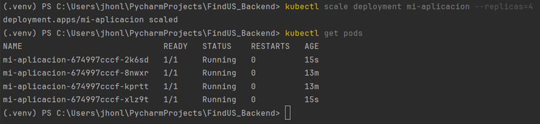

### Paso 1: Crear el clúster de Kubernetes

Entré a la consola de Google Cloud:
1. Fui a Kubernetes Engine > Clusters > Crear Clúster.

2. Configuré el clúster con:
   - Nombre: my-first-cluster-1
   - Zona: us-central1-c
   - Tipo de máquina: e2-medium
   - Cantidad de nodos: 2
   - Modo: Standard
   

Previamente creé una cuenta en Google Cloud e instalé y configué Google Cloud SDK.

### Paso 2: Conectarse al clúster con kubectl
Ejecuté el siguiente comando para obtener las credenciales de acceso:

Verificación de la conexión al clúster y visualización de los nodos:

### Paso 3: Desplegar una aplicación en el cluster
Se crea el archivo `deployment.yaml` para el despliegue:

verificamos que los pods estén corriendo y el despliegue se haya hecho correctamente:

Se crea el servicio para exponer la aplicación:

Verificamos la ip aplicada al servicio previamente expuesto:

### Paso 4: Escalar la Aplicación

Escalamiento del número de réplicas del deployment a 4:

### Paso 5: Limpiar Recursos

Eliminé el deployment y el servicio:

fin.